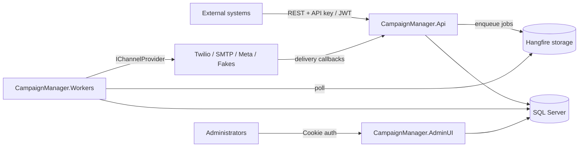

# Solution Architecture

## Overview

Campaign Manager is a multi-tenant, provider-agnostic campaign platform for SMS, Email and
WhatsApp. It follows Clean Architecture: business rules never depend on frameworks, providers,
or persistence details.

## Projects and dependency rule

| Project | Depends on | Responsibility |
|---|---|---|
| `Domain` | nothing | Entities, enums, state machines, domain exceptions |
| `Contracts` | nothing | DTOs shared with external consumers |
| `Application` | Domain, Contracts | CQRS handlers (MediatR), validators, provider **interfaces**, job contracts |
| `Infrastructure` | Application | EF Core, Identity, provider implementations, Hangfire jobs, encryption |
| `Api` | Infrastructure | REST host: auth, Swagger, ProblemDetails, health, webhooks |
| `Workers` | Infrastructure | Hangfire server + dashboard |
| `AdminUI` | Infrastructure | MVC admin: login, campaign monitoring, charts |

Dependencies point inward only. `Application` defines `IChannelProvider`, `ICampaignDispatcher`,
`IAppDbContext`, `ICredentialProtector`, `ICurrentTenant`; `Infrastructure` implements them.

## Key patterns

- **CQRS with MediatR** — commands (`CreateCampaign`, `CancelCampaign`) and queries
  (`GetCampaignStatus`, `SearchCampaigns`) with a FluentValidation pipeline behavior.
- **Strategy pattern for providers** — `ProviderRegistry` indexes all `IChannelProvider`
  implementations by `(Channel, ProviderKey)`; `ProviderSelector` orders an organization's
  enabled configurations by priority; `FailoverSender` walks that list.
- **State machines as pure functions** — `CampaignStateMachine` / `MessageStateMachine`
  hold the transition maps; entities expose `TransitionTo` which throws on illegal moves.
- **Repository pattern deliberately not used** — `IAppDbContext` (EF Core DbSets behind an
  interface) is the unit of work; query logic lives in handlers, which is simpler and equally
  testable at this scale.
- **Multi-tenancy** — every tenant-owned row carries `OrganizationId`; EF global query filters
  scope all queries to the ambient tenant (`CurrentTenant`), set from auth claims (HTTP) or
  job arguments (workers).

## Why these choices

- **Hangfire over a broker (P1)**: one moving part (SQL storage), built-in scheduling, retries
  and dashboard. The `ICampaignDispatcher` abstraction means a move to RabbitMQ/Azure Queues
  later only replaces Infrastructure code.
- **Separate Api and Workers hosts**: API latency is isolated from send throughput; both scale
  independently (stateless API replicas; multiple Hangfire servers compete for jobs safely).
- **Contracts as a dependency-free library**: can be published as a NuGet for API consumers.
