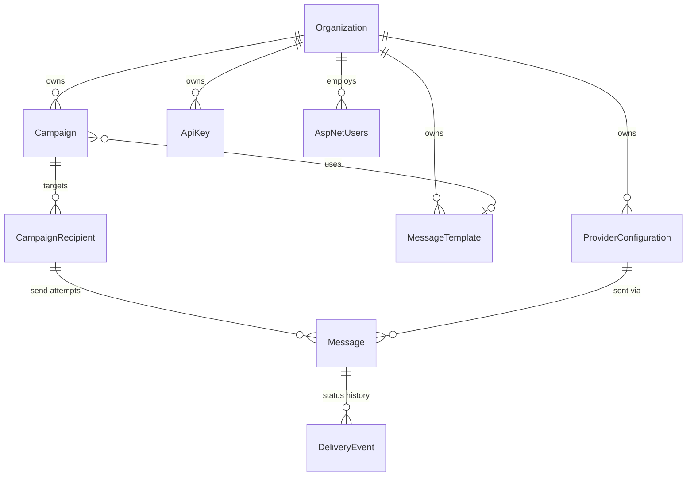

# Database Schema

SQL Server; schema owned by EF Core migrations (`src/CampaignManager.Infrastructure/Persistence/Migrations`).
Hangfire owns its own `hangfire` schema (created at startup, invisible to EF).

## ERD

## Tables

High-volume tables (`Messages`, `CampaignRecipients`, `DeliveryEvents`, `AuditLogs`) use
**bigint identity clustered PKs** (append-only, no page splits). `Messages.PublicId` (guid,
unique) is the external correlation id. All tenant tables carry `OrganizationId`.

- **Organizations** — `Id` guid PK, `Name`, `Slug` (unique), `IsActive`.
- **Campaigns** — guid PK, `TrackingId` nvarchar(32) unique (`CMP-…`), `Channel`/`Status`
  tinyint enums, `TemplateId?`, inline `MessageBody?`/`Subject?`, `Sender`,
  `ScheduledAtUtc?` + `ScheduledJobId?` (Hangfire job for cancellation), `Priority`,
  `TagsJson`, `MetadataJson`, `CallbackUrl?`, denormalized counters (`TotalRecipients`,
  `SentCount`, `DeliveredCount`, `FailedCount` — written only by the finalizer job),
  `RowVersion` (optimistic concurrency on status transitions).
- **CampaignRecipients** — bigint PK, `Address` (320), `PersonalizationJson` (placeholder values).
- **Messages** — bigint PK, `PublicId` guid, `Status`, `ProviderConfigurationId?`,
  `ProviderMessageId?` (Twilio SID / Meta id, correlates webhooks), `AttemptCount`,
  `LastError` (1024), `QueuedAt/SentAt/DeliveredAt/UpdatedAtUtc`. The rendered body is
  **not** stored per message (it is recomputable) — keeps rows narrow at millions scale.
- **DeliveryEvents** — append-only status history (status, detail, raw payload, occurred-at).
- **ProviderConfigurations** — `ProviderKey` (matches `IChannelProvider.ProviderKey`),
  `Priority` (lower wins), `IsEnabled`, `EncryptedCredentials` varbinary (Data Protection),
  `SettingsJson` (non-secret), `WebhookSecret`.
- **MessageTemplates** — per-channel, `Subject?`, `Body` with `{{Placeholder}}` tokens.
- **ApiKeys** — `KeyHash` (SHA-256 hex), `KeyPrefix` (12 chars, lookup index), expiry/revocation.
- **AuditLogs** — who/what/when/IP/old/new (P1: table exists; population is Phase 2).
- **AspNetUsers/Roles/…** — ASP.NET Identity with `AppUser.OrganizationId`.

## Indexes

| Table | Index | Serves |
|---|---|---|
| Campaigns | `UX TrackingId` | tracking lookup |
| Campaigns | `(OrganizationId, Status, CreatedAtUtc DESC)` | list/search pages |
| CampaignRecipients | `(CampaignId, Id)` | keyset batch reads |
| Messages | `UX PublicId` | external correlation |
| Messages | `(CampaignId, Status)` | dispatch fan-out + progress stats |
| Messages | `(OrganizationId, QueuedAtUtc)` | tenant reporting |
| Messages | `ProviderMessageId` filtered `IS NOT NULL` | **webhook hot path** |
| DeliveryEvents | `(MessageId)` | history lookup |
| ApiKeys | `(KeyPrefix)` | auth lookup |
| AuditLogs | `(OrganizationId, TimestampUtc)` | audit search |

## Scale-out plan (documented, not built)

- **Partition `Messages` and `DeliveryEvents` by month** (`QueuedAtUtc`/`OccurredAtUtc`)
  with a sliding-window function/scheme; pair with an archive-and-truncate retention job.
- Until partitioning: retention via batched deletes by `Id` range (no long locks).
- Recipient import beyond ~100k/request: switch chunked `AddRange` to `SqlBulkCopy`
  (EFCore.BulkExtensions) and stream the upload (see 11-scalability).
