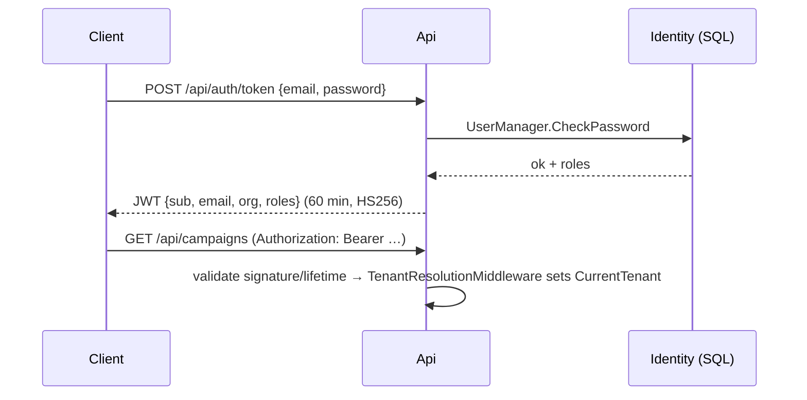

# Authentication & Authorization

Three principals, one tenant model: every authenticated caller resolves to an
`OrganizationId` claim (`org`), which drives EF global query filters.

## 1. JWT (interactive API users)

- Issued by `JwtTokenService`; key from `Jwt:SigningKey` (32+ chars enforced). In production
  the key comes from a secret store, and rotation means dual-key validation (Phase 2).
- The Api uses **`AddIdentityCore`**, not `AddIdentity` — the full Identity stack would
  register cookie handlers whose 302-redirects corrupt API 401 responses.

## 2. API keys (machine-to-machine)

- Format `cmk_…`; stored as SHA-256 hash + 12-char prefix. Lookup by indexed prefix, then
  constant-time hash comparison (`CryptographicOperations.FixedTimeEquals`).
- Sent via `X-Api-Key`. Principal gets role `ApiClient` + the key's `org` claim.
- Keys support expiry (`ExpiresAtUtc`) and revocation (`RevokedAtUtc`); plaintext is shown
  once at creation only.

## 3. Admin UI cookies

- Classic Identity cookie sign-in (`SignInManager`), lockout enabled.
- `AppUserClaimsPrincipalFactory` injects the `org` claim into the cookie principal so the
  AdminUI shares the exact tenant-resolution path (inline middleware → `ITenantSetter`).
- Anti-forgery tokens on all POSTs (CSRF protection); `LoginPath=/Account/Login`.

## Authorization

- Policy `ApiAccess` accepts either scheme (`JwtBearer` **or** `ApiKey`) and requires an
  authenticated user; applied to all campaign endpoints.
- Roles seeded: `Admin`, `Operator`, `Viewer` (+ implicit `ApiClient`). Fine-grained
  permission checks are Phase 2; the scaffolding (role claims in both principals) is in place.
- Webhooks are anonymous by necessity (providers can't do JWT) but require the provider
  configuration's `WebhookSecret` compared in constant time.

## OAuth readiness

JWT validation parameters are standard OIDC-compatible; moving to an external IdP later means
pointing `TokenValidationParameters` at the IdP's metadata and dropping the local token
endpoint — resource-side code is unchanged.
