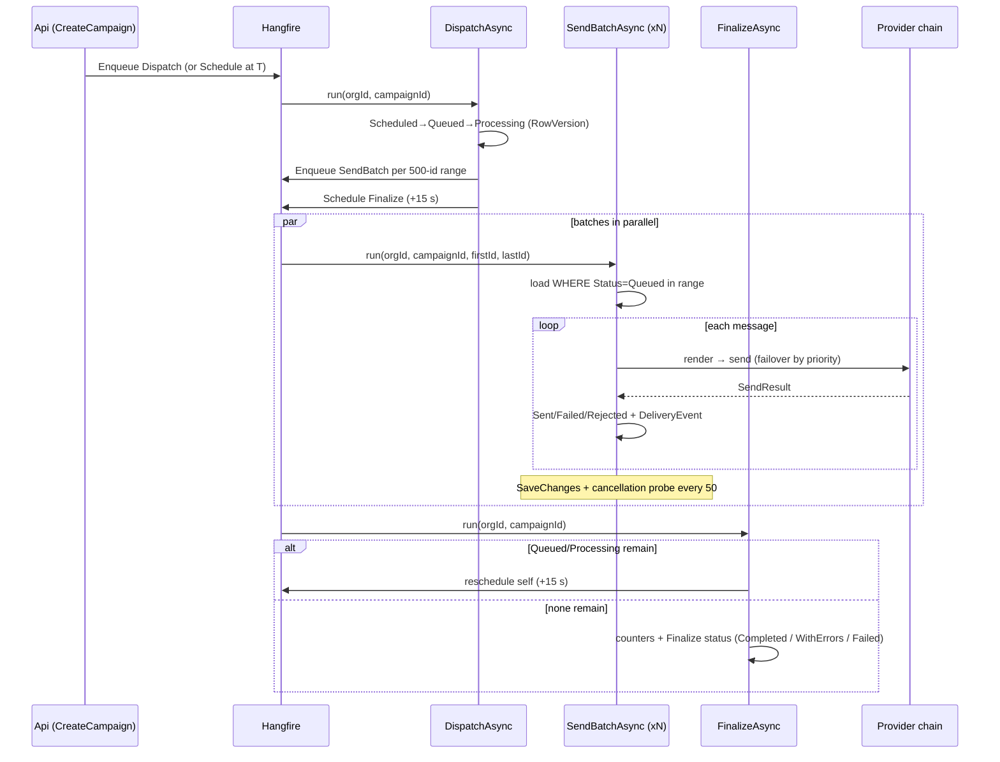

# Background Processing

Hangfire with SQL Server storage (`hangfire` schema). The Workers host runs the server
(dashboard at `/hangfire`); the Api only enqueues via `ICampaignDispatcher`. Jobs are declared
by contract (`ICampaignProcessingJob` in Application) and implemented in Infrastructure
(`CampaignProcessingJob`), so any host — or a test — can execute them.

## Job topology

## Reliability semantics

- **Idempotency**: the database is the source of truth. Jobs derive work from message
  `Status`; a re-executed job (Hangfire is at-least-once) skips rows that already advanced.
  Batch jobs take disjoint id *ranges*, so duplicate enqueues are harmless.
- **Retries**: `[AutomaticRetry(3, delays 30/120/600 s)]` on dispatch and batch jobs.
  Within a batch, provider-level transient failures fail over to the next provider
  immediately; messages whose whole chain failed are marked `Failed` (a requeue sweep is a
  Phase-2 recurring job).
- **Exactly-once caveat**: a crash between a provider accept and `SaveChanges` can double-send
  up to the 50-row sub-chunk. This window is inherent to messaging APIs without idempotency
  keys; it is minimized (small chunks) and documented rather than hidden.
- **Cancellation**: `CancelCampaign` sets the campaign terminal, deletes the scheduled job,
  and bulk-expires queued messages; running batches notice via a cheap status probe every 50
  messages and expire their remaining range.
- **Poison messages**: after Hangfire retries exhaust, the job lands in the Failed set on the
  dashboard (manual replay); messages remain in a consistent state because every transition
  is persisted.
- **Multi-tenancy in jobs**: no ambient HTTP context — `organizationId` travels as a job
  argument and `ITenantSetter` establishes scope inside the job.

## Queues & scaling

Server listens on `campaigns`, `sends`, `default` (WorkerCount configurable, default 8).
Multiple Workers instances can run concurrently — Hangfire's storage locks make job
distribution safe; batches parallelize across instances naturally.
