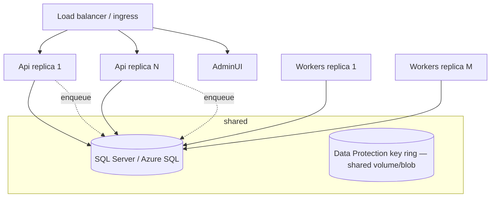

# Deployment, Containers & CI/CD

## Topology



- **Api is stateless** — scale horizontally behind any LB; no sticky sessions.
- **Workers scale by adding replicas** — Hangfire storage locks distribute jobs safely.
- **Shared Data Protection key ring** (mounted volume, blob storage, or Redis) is mandatory:
  all hosts must decrypt the same provider credentials and admin cookies.
- Redis (Phase 2) for response caching and dashboard counter caching.

## Containers

Local dev uses `podman-compose.yml` (SQL Server 2022, named volume, healthcheck). App images
build from `Dockerfile` (multi-stage, `PROJECT` build-arg selects Api/Workers/AdminUI):

```bash
podman build -t campaignmanager-api     --build-arg PROJECT=CampaignManager.Api .
podman build -t campaignmanager-workers --build-arg PROJECT=CampaignManager.Workers .
podman build -t campaignmanager-adminui --build-arg PROJECT=CampaignManager.AdminUI .
```

Connection strings, `Jwt__SigningKey` and `DataProtection__KeysPath` are injected as
environment variables/secrets — never baked into images.

## CI/CD recommendations

Pipeline (GitHub Actions / Azure DevOps):

1. `dotnet restore` (lock CPM versions) → `dotnet build -warnaserror`.
2. `dotnet test` unit tests (no external deps).
3. Integration tests against a service-container SQL Server (the suite creates and drops a
   per-run database).
4. Build + push the three images (tag = git SHA).
5. Deploy to staging → run `scripts/smoke.sh` against staging.
6. Manual gate → production. EF migrations applied by the Api on startup
   (`Database:MigrateOnStartup`); for zero-downtime fleets switch to a dedicated migration
   job step and set the flag false.

Secrets in the platform vault (GitHub Environments / Key Vault). Dependabot/Renovate on
`Directory.Packages.props` gives one-file dependency updates.
