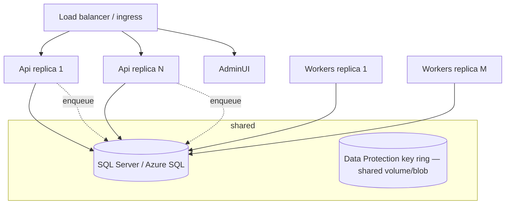

# Deployment, Containers & CI/CD

## Topology



- **Api is stateless** — scale horizontally behind any LB; no sticky sessions.
- **Workers scale by adding replicas** — Hangfire storage locks distribute jobs safely.
- **Shared Data Protection key ring** (mounted volume, blob storage, or Redis) is mandatory:
  all hosts must decrypt the same provider credentials and admin cookies.
- **Redis** (Phase 3) backs the distributed cache (provider configs, dashboard tiles) and the
  cross-instance provider rate limiter; both fall back to a single-process implementation when
  `ConnectionStrings:Redis` is unset, so Redis is optional for a single-instance deployment.

## Containers

Local dev uses `podman-compose.yml` (SQL Server 2022, named volume, healthcheck). App images
build from `Dockerfile` (multi-stage, `PROJECT` build-arg selects Api/Workers/AdminUI):

```bash
podman build -t campaignmanager-api     --build-arg PROJECT=CampaignManager.Api .
podman build -t campaignmanager-workers --build-arg PROJECT=CampaignManager.Workers .
podman build -t campaignmanager-adminui --build-arg PROJECT=CampaignManager.AdminUI .
```

Connection strings, `Jwt__SigningKey` and `DataProtection__KeysPath` are injected as
environment variables/secrets — never baked into images.

## Observability stack (optional, Phase 3)

`podman-compose.yml` includes an `observability` profile (OTel collector, Prometheus, Grafana)
that is off by default:

```bash
podman-compose --profile observability up -d
```

- **Api** and **Workers** each expose `GET /metrics` (OpenTelemetry Prometheus exporter,
  `campaignmanager_*` custom metrics — messages sent/failed, provider send duration, campaigns
  created/completed, webhooks received — plus ASP.NET Core/HttpClient/.NET runtime
  instrumentation). `observability/prometheus.yml` scrapes both directly at
  `host.containers.internal:5080` / `:5090`.
- **otel-collector** is optional and only used if a host also sets `OpenTelemetry:OtlpEndpoint`
  (traces + metrics forwarded via OTLP instead of/alongside the Prometheus scrape).
- **Grafana** (`http://localhost:3000`, anonymous viewer access in dev) auto-provisions the
  Prometheus datasource and one starter dashboard
  (`observability/grafana/provisioning/dashboards/json/campaignmanager.json`): messages
  sent/failed per minute, provider send duration p50/p95, campaigns created/completed by
  status, webhooks received by provider, and GC heap size.

## CI/CD recommendations

Pipeline (GitHub Actions / Azure DevOps):

1. `dotnet restore` (lock CPM versions) → `dotnet build -warnaserror`.
2. `dotnet test` unit tests (no external deps).
3. Integration tests against a service-container SQL Server (the suite creates and drops a
   per-run database).
4. Build + push the three images (tag = git SHA).
5. Deploy to staging → run `scripts/smoke.sh` against staging.
6. Manual gate → production. EF migrations applied by the Api on startup
   (`Database:MigrateOnStartup`); for zero-downtime fleets switch to a dedicated migration
   job step and set the flag false.

Secrets in the platform vault (GitHub Environments / Key Vault). Dependabot/Renovate on
`Directory.Packages.props` gives one-file dependency updates.
